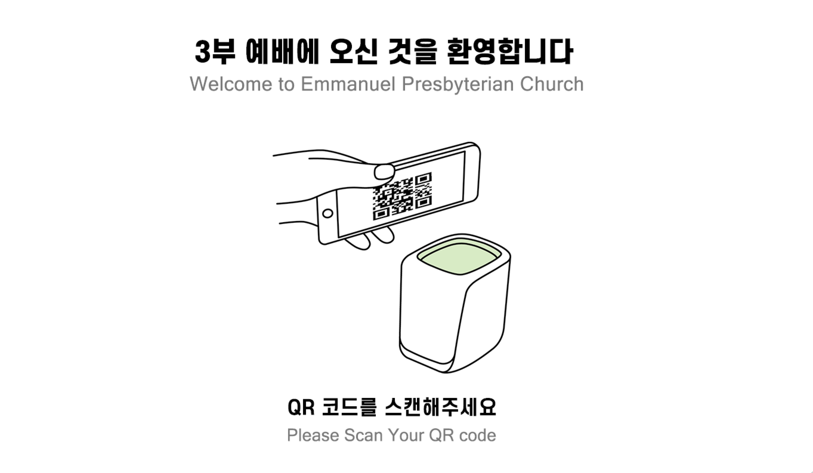
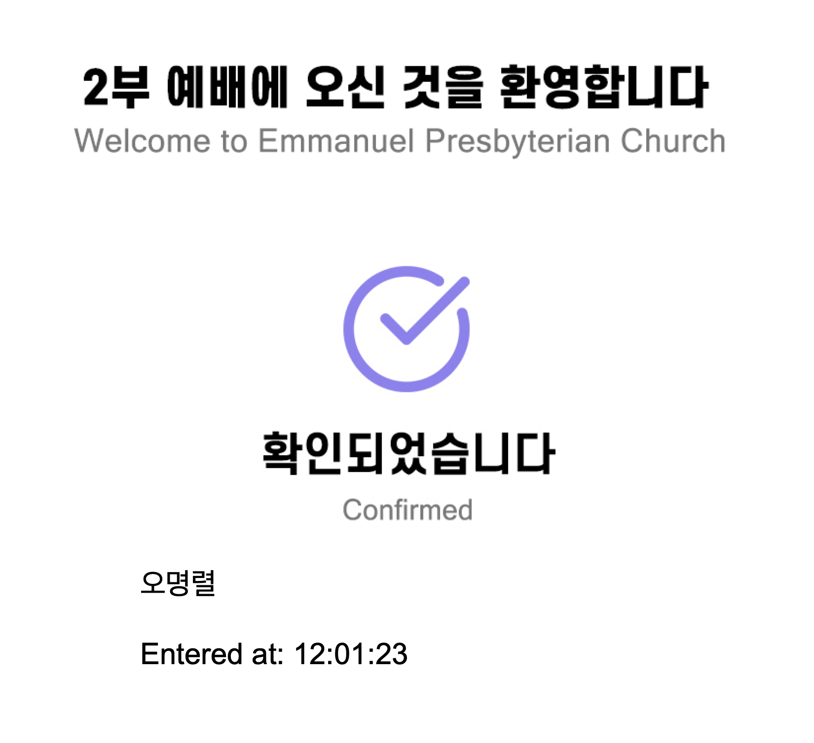
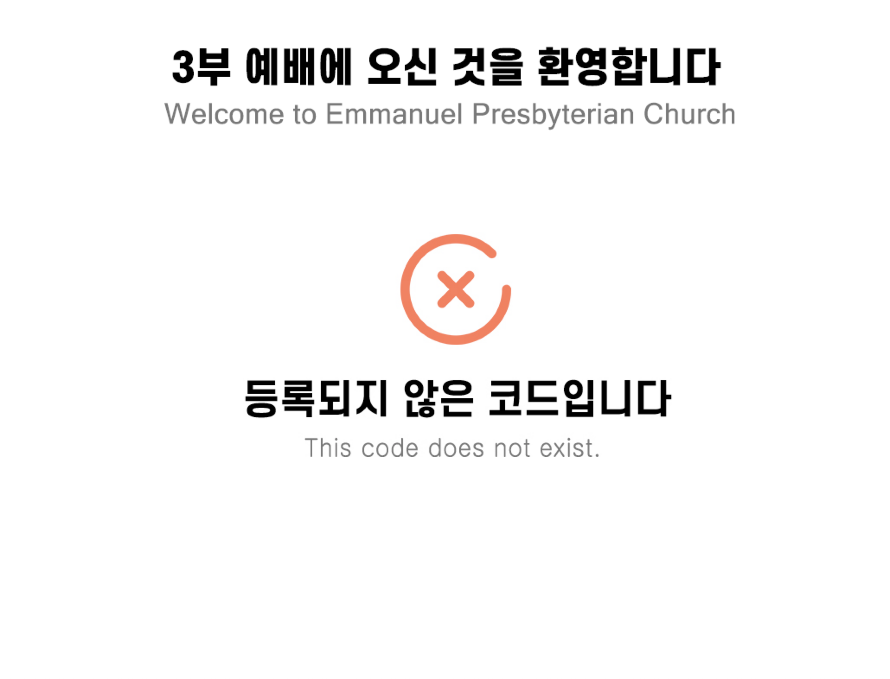
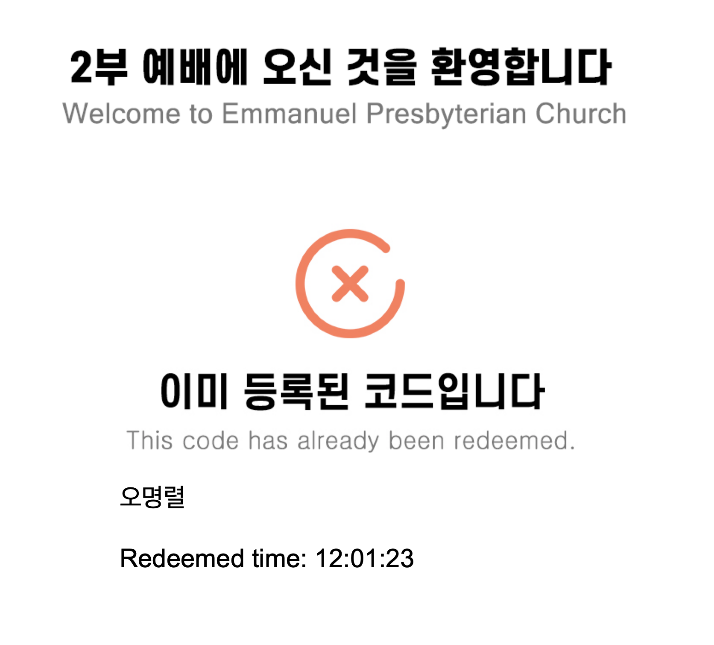
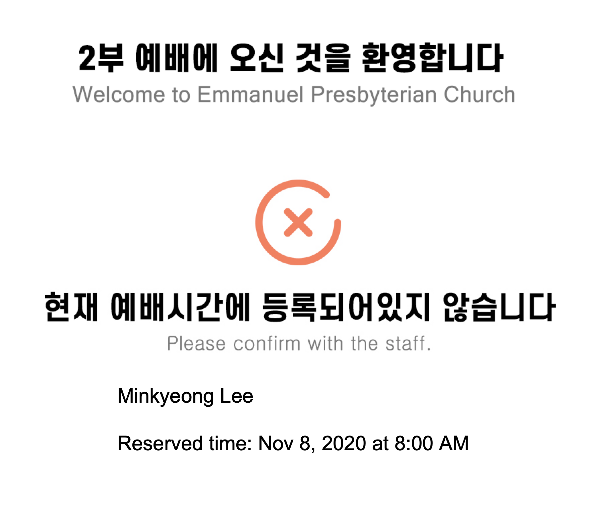

# Emmanuel Presbyterian Church Pre-registration Program

Pre-registration, QR codes to welcome people back to Emmanuel Presbyterian Church

### Prerequisites

People have to register before attending every service of EPC(Emmanuel Presbyterian Church) from [EventBrite](www.eventbrite.com)

What things you need to install the software and how to install them

```python
pip install openxlr
pip install tkinter
pip install PIL
```

## Running the tests

- ### Default / Instruction Screen



- ### In case QR code succesfully redeemed



- ### In case QR code redeemed does not exist



- ### In case QR code has already been redeemed



- ### In case registered service time does not match current service



- ### As an output, Log file contains information of attendees including name, phone number, email address, and entered time

## Authors

- **Jooyul Yoon** - _developed_ - [GitHub](https://github.com/jooyul-yoon)
- **Dennis Lee** - _Initial work_
- **Eileen Yoon** - _Designed_ [LinkedIn](https://www.linkedin.com/in/jooyoungeileenyoon/)
